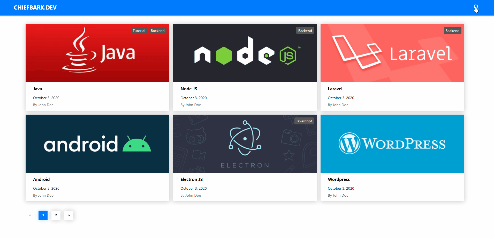

# Strapi Blog

Simple blog website built with [Strapi](https://strapi.io/) and [ReactJS](https://reactjs.org/).

**Table of contents**
- [Strapi Blog](#strapi-blog)
	- [Overview](#overview)
		- [Home view](#home-view)
		- [Post view](#post-view)
	- [Usage](#usage)
	- [Credentials](#credentials)

## Overview

### Home view


The home page will show all the posts that are published, on pages with 6 elements each.
<br>
This setting can be modified under `frontend/src/utils/index.js` by overriding the constant `MAX_LIMIT`.

You can filter the posts by name and/or tag too.



### Post view


## Usage

- Clone this repository 

    ```
    git clone https://github.com/Chiefbark/strapi-blog.git
    ```
- Setup the strapi backend
    ```
    cd strapi-blog/backend
    ```
    Install package dependencies, build strapi admin panel and start the process
    ```
    npm install
    npm run build
    npm run start
    ```
    Your strapi instance will load at http://localhost:1337/admin

- Run the react frontend
    ```
    cd strapi-blog/frontend
    ```
    Install package dependencies and start the process
    ```
    npm install
    npm run start
    ```
    Your react instance will load at http://localhost:3000/

## Credentials

**John Doe** (Author account)
- **Email**: johndoe@domain.com 
- **Password**: M123456789m

**Admin** (Admin account)
- **Email**: admin@domain.com 
- **Password**: M123456789m